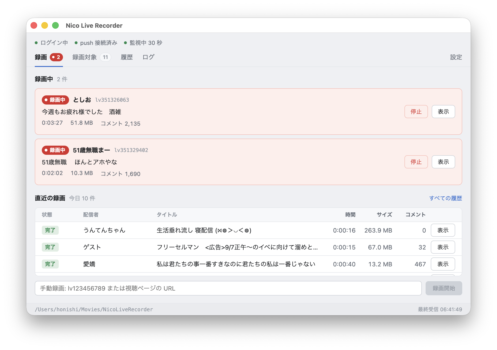

# NicoLiveRecorder

登録した配信者のニコニコ生放送を自動で検知し、映像とコメントを保存する Windows / macOS 向けアプリです。
放送中の番組 ID や URL を指定した手動録画にも対応しています。

## インストール

[Releases](https://github.com/honishi/nico-live-recorder/releases/latest) からダウンロードしてください。

- **macOS (Apple Silicon)**: `.dmg` を開き、アプリを「アプリケーション」フォルダへ移動します。
- **Windows (x64)**: `.exe` を実行します。現在は未署名のため、「Windows によって PC が保護されました」と出た場合は「詳細情報」→「実行」を選んでください。

ニコニコのアカウントと十分な空き容量が必要です。映像は取得できる最高画質で保存するため、必要な容量は放送のビットレートと録画時間によって変わります。FFmpeg はアプリに同梱しているので、別途インストールする必要はありません。

## 使い方

1. 「録画」タブの「ニコニコにログイン」、または「設定」→「アカウント」の「ログイン」からニコニコにログインします。
2. 録画したい配信者をニコニコ側で **フォロー** し、「録画対象」タブにユーザー ID かユーザーページの URL を追加します。
3. 放送が始まると自動で録画し、終了すると停止します。録画中の番組は「録画」タブ、保存した録画は「履歴」タブで確認できます。

放送開始は push 通知と定期確認 (既定 30 秒) で検知します。どちらもログイン中のアカウントがフォローしている配信者が対象です。アプリからフォロー操作は行いません。既定では、起動時に既に放送中の対象も録画します。

手動で録画する場合は、ログイン後に「録画」タブ下部へ `lv123456789` のような番組 ID または視聴ページの URL を入力し、「録画開始」を押します。手動録画には録画対象への登録やフォローは不要です。終了済み番組のタイムシフト録画には対応していません。

録画カードの「停止」で途中停止できます。手動停止した番組は、アプリを起動している間は自動で録画し直しません。再開する場合は手動録画を使ってください。

ウィンドウを閉じても検知と録画は続きます。終了するときはトレイ (macOS はメニューバー) のメニューを使ってください。

### 保存先と設定

既定の保存先は macOS が `ムービー/NicoLiveRecorder`、Windows が `ビデオ\NicoLiveRecorder` です。トレイの「録画フォルダを開く」から開けます。

「設定」タブで保存先、確認間隔、空き容量の警告、通知などを変更できます。空き容量の警告が出ても録画は止まりません。

- 確認間隔は 15〜300 秒 (既定 30 秒) です。push 通知を無効にすると定期確認だけになります。
- 空き容量は既定で 5 GB 未満になると警告します。0 を指定すると確認を無効にします。
- 保存先の変更は次に開始する録画から反映されます。録画中のファイルや既存の録画は移動しません。

ログアウトは「設定」→「アカウント」から行います。確認すると監視と進行中の録画を停止し、ログイン情報を削除します。設定・履歴・保存した録画は残ります。

### アプリの更新

起動時と 6 時間ごとに新しいバージョンを確認し、見つかると画面上部に案内を表示します。「設定」→「情報」の「更新を確認」からも確認できます。「リリースページを開く」から新しい版をダウンロードし、アプリを終了してから入れ替えてください。

## 保存するファイル

配信者ごとのフォルダに、放送単位で次を保存します。

- `.ts`: 映像と音声 (MPEG-TS)
- `.comments.csv`: コメント (ヘッダー付き UTF-8。Excel などの表計算ソフトで開けます)
- `.json`: 番組情報と録画結果 (映像ファイルごと)

通信切断などで映像が止まった場合は、自動で再開を試みます。再開時は `_2.ts`, `_3.ts` のように映像と対応する JSON が分かれ、コメントは同じ CSV に追記します。ファイル名や設定・ログの場所は [ファイル一覧](docs/files.md) を参照してください。

録画ファイルは自動削除しません。「履歴」タブの右クリックメニューで「履歴から削除」を選んでもファイルは残ります。

## うまくいかないとき

- 検知されない場合は、配信者をフォロー済みか、録画対象が有効か、画面上部が「監視中」かを確認してください。
- ログイン切れのバナーが出たら再ログインしてください。
- エラーの詳細は「ログ」タブで確認できます。

## 開発者向け

[開発者向けドキュメント](docs/development.md) を参照してください。

## ライセンス

アプリ本体は [MIT ライセンス](LICENSE) です。同梱する [FFmpeg](https://ffmpeg.org/) / ffprobe は LGPL-2.1-or-later です (Copyright (c) 2000-2026 the FFmpeg developers)。

FFmpeg のライセンス本文、著作権表示、完全な対応ソースとビルド手順はアプリに同梱しています。設定の「情報」→「FFmpeg のライセンス・ソース」から参照できます。
